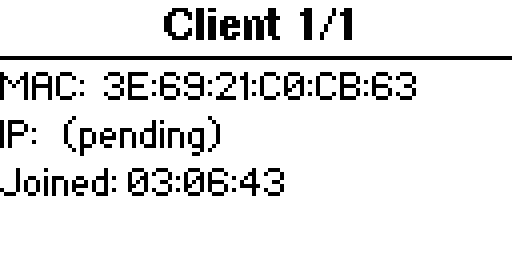

# Flytrap

A from-scratch **captive-portal ("evil portal") suite for the Flipper Zero + ESP32-S2
WiFi dev board** — built as a hands-on way to *learn how captive portals actually work*.

<p align="center">
  
</p>

Most "sign in to WiFi" pages you've seen at cafés and airports are captive portals.
Flytrap is a small, readable implementation of the same idea — an open access point that
serves a login page and shows you what gets submitted — so you can see every moving part.
It's tuned for the **official Flipper WiFi dev board (ESP32-S2)**, which has no SD card and
trips up heavier tools.

## What you'll learn

- How a captive portal captures a device: **open AP + wildcard DNS + catch-all web server + a form**.
- How a Flipper app and an ESP32 cooperate over a **UART** link (with a documented protocol).
- How a real Flipper app is structured: scenes, views, a background UART worker, SD storage.

Start with **[docs/HOW-IT-WORKS.md](docs/HOW-IT-WORKS.md)** for the concepts, and
**[docs/PROTOCOL.md](docs/PROTOCOL.md)** for the exact serial commands.

## ⚠️ Responsible use

Flytrap creates a fake open Wi-Fi network that serves a login page and captures whatever is
submitted. It exists to **teach how these attacks work so they can be defended against**.

- **Intended for:** students, security researchers, and network admins testing **their own**
  equipment or systems they are **explicitly authorized** to test.
- **The rule:** only run it on networks and devices you **own** or have **written permission**
  to test. Operating a fake AP to capture other people's credentials without consent is
  **illegal** in most jurisdictions.
- The bundled portal pages are **simulated templates for education only** — not affiliated
  with any brand.
- The authors accept no liability for misuse. You are responsible for how you use this.

If that's not your use case, this isn't the project for you.

## Features

- On-device **portal picker**, **SSID** entry, and start/stop — all from the Flipper.
- Live **dashboard**: broadcasting status, credential + client counters.
- **Captures** as a browsable list → detail, with fields **url-decoded** and readable;
  everything also logged to `capture_<N>.txt` on the SD card.
- **Live clients** list → detail (MAC, IP, joined time). Joins and leaves update the
  count in real time, so a device that disconnects drops off instead of lingering.
- **Flash the ESP from the Flipper** — no computer. **Flash Firmware** picks a
  firmware bundle off the SD, auto-detects the board in download mode, and writes it
  over the GPIO UART (vendored [esp-serial-flasher](https://github.com/espressif/esp-serial-flasher)).
- **Capture alerts** (haptic / beep / LED) with a **Settings** screen to toggle them.
- A **Console** view (from the menu during a session) showing the raw serial protocol live.
- Lightweight enough to run reliably on the SD-less ESP32-S2 dev board.

## Hardware

- **Flipper Zero** (developed on **Momentum** firmware; other forks work with a matching
  `ufbt` SDK).
- **Official Flipper WiFi Dev Board (ESP32-S2)** — or any generic ESP32-S2. It mounts on the
  Flipper's GPIO header, which wires the two together over UART.

## Install

**The easy way — no computer flashing.** The `.fap` bundles the portal *and* the
ESP firmware, so:

1. Download **`flytrap.fap`** from the [latest release](https://github.com/tarikbc/flytrap/releases/latest)
   and copy it to your Flipper SD at `/ext/apps/GPIO/` (the portal + firmware
   extract to the SD on first launch).
2. Mount the **ESP32-S2 dev board** on the Flipper's GPIO header.
3. **Apps → GPIO → [ESP32] Flytrap → Start Portal.** On a board that isn't running
   Flytrap firmware yet, it offers **Install firmware** — hold **BOOT**, tap
   **RESET**, release **BOOT**, and it flashes over the GPIO UART, then continues to
   broadcasting. No computer, no esptool.

**Build from source (developers).** Flytrap is two binaries — the Flipper app and
the ESP firmware:

```sh
# ESP32-S2 firmware -> esp32/flytrap-fw/build/*.bin  (needs arduino-cli; see tools/README.md)
arduino-cli compile --fqbn esp32:esp32:esp32s2:PartitionScheme=huge_app \
  --libraries esp32/libs --output-dir esp32/flytrap-fw/build esp32/flytrap-fw

# Flipper fap (bundles the built firmware + portal) -> flipper/flytrap/dist/flytrap.fap
tools/build-fap.sh

# copy the fap + portals + firmware bundle to the SD
python3 tools/deploy-to-flipper.py --port /dev/cu.usbmodemflip_XXXX
```

Prefer to flash the ESP from a computer with `esptool`? That still works — see
[tools/README.md](tools/README.md).

## Usage

On the Flipper: **Apps → GPIO → [ESP32] Flytrap**.

1. **Set SSID** — the name of the fake network.
2. **Start Portal** — uses the bundled **social** portal by default (or **Select
   Portal** first to pick another `.html` from `portals/`). If the board needs
   firmware, it walks you through **Install firmware** and then continues.
3. The ESP begins broadcasting; the dashboard shows **● Broadcasting**.
4. Connect a **test** device — the captive page pops up; submit to see a capture.
5. **Captures** → browse the list, open one for the decoded fields (Prev/Next to page).
6. **Clients** → see who's connected right now (MAC, IP, joined time); it updates live.

| Screen | Buttons |
|---|---|
| Menu / lists | **↑/↓** move · **OK** select · **←(Back)** back/exit |
| Dashboard | **←** Captures · **→** Clients · **Back** to menu (Console is in the menu) |
| Capture / client detail | **↑/↓** scroll · **←** Prev · **→** Next |
| Settings | **←/→** toggle a value |

<p align="center">
  
  
  
</p>

## Portal templates

A portal is just an HTML file with a `<form>`. Drop `.html` files in
`/ext/apps_data/flytrap/portals/` on the SD card and pick one in the app. If a template
contains the token `{{SSID}}`, Flytrap replaces it with the configured network name before
serving. Please keep bundled templates labeled as educational simulations.

## Documentation

- **[HOW-IT-WORKS.md](docs/HOW-IT-WORKS.md)** — captive portals explained (and how to defend).
- **[PROTOCOL.md](docs/PROTOCOL.md)** — the Flipper↔ESP serial command reference.
- **[ARCHITECTURE.md](docs/ARCHITECTURE.md)** — how the code is organized.

## Troubleshooting

- **Portal never starts / stuck "Starting…":** the ESP board must be seated on the GPIO
  header and running Flytrap firmware. Open **Console** to watch the handshake
  (`STATUS html_ok → ap_ok → portal_up`).
- **Flipper CLI unresponsive over USB:** hard-reboot the Flipper (hold **←/LEFT + Back** ~5s).
- **ESP32-S2 flash drops mid-erase:** don't use `--erase-all` — the S2's native USB
  disconnects during a full chip erase.

## Contributing

Issues and PRs welcome. Keep the app lightweight (it targets an SD-less board), run the
build (`ufbt` for the app, `arduino-cli` for the firmware — see the CI workflow), and keep
the responsible-use framing intact.

## Credits

- Protocol and concept derive from
  [bigbrodude6119/flipper-zero-evil-portal](https://github.com/bigbrodude6119/flipper-zero-evil-portal) (MIT).
- UI patterns informed by the GhostESP and Marauder Flipper apps.

## License

MIT — see [LICENSE](LICENSE).
