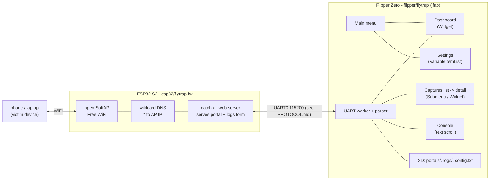

# Architecture

Flytrap is two programs plus a serial link between them.



## ESP32-S2 firmware (`esp32/flytrap-fw/flytrap-fw.ino`)

A single Arduino sketch. It holds the portal HTML in RAM (streamed from the
Flipper), runs an open `WiFi.softAP`, a wildcard `DNSServer`, and an
`ESPAsyncWebServer` catch-all handler. Submitted form fields go back over UART as
`CRED` lines; station joins as `HIT`. All protocol output is serialized behind a
mutex so the loop / WiFi-event / async-server tasks can't interleave a line. It
touches no filesystem — see [PROTOCOL.md](PROTOCOL.md).

## Flipper app (`flipper/flytrap/`)

A standard `ViewDispatcher` + `SceneManager` app.

| File | Role |
|---|---|
| `flytrap.c` / `flytrap_i.h` | alloc/free, the app struct, the global UART→GUI event bridge |
| `flytrap_uart.c` | IRQ → stream buffer → worker thread that wakes the GUI; two-phase teardown |
| `helpers/flytrap_session.c` | start/stop the portal, parse ESP lines, store captures, fire alerts |
| `helpers/flytrap_storage.c` | FlipperFormat config, portal/HTML + log file I/O, RTC timestamps |
| `helpers/flytrap_format.c` | url-encode/decode + `key=value` → readable field pretty-printer |
| `scenes/flytrap_scene_*.c` | main menu, ssid input, settings, dashboard (live), captures list, capture detail, textview (console/log) |

### Threading model

The UART **interrupt** pushes bytes into a stream buffer and wakes a small worker
thread. The worker's *only* job is to post one custom event to the ViewDispatcher —
**all parsing and state mutation happen on the GUI thread** (in the global custom-event
handler), so there are no locks and no data races. Views are updated by re-rendering
on a refresh event; text views take a stable snapshot on enter. Captured credentials
are appended to `logs/capture_<N>.txt` on the SD card as they arrive.

### Scenes & views

- **Views** (reused across scenes): `Submenu`, `Widget`, `TextInput`, `VariableItemList`.
- **Scenes:** main menu → {dashboard, ssid input, settings, view-logs}; dashboard →
  {captures list → capture detail, console}. The portal **session persists** across the
  menu and sub-views; it's stopped from the menu or on app exit.

## Repo layout

```
flipper/flytrap/     the .fap app (ufbt, Momentum SDK)
esp32/flytrap-fw/    the ESP32-S2 firmware (arduino-cli)
portals/             bundled HTML portal templates
tools/               deploy/flash helpers
docs/                this documentation
```
